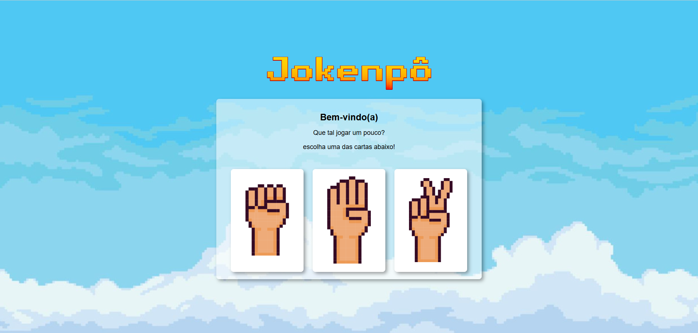

# 🌑📄✂️ Jogo Jokenpô - Pedra, Papel e Tesoura

Um jogo simples e divertido de Pedra, Papel e Tesoura desenvolvido com **HTML**, **CSS** e **JavaScript**, totalmente responsivo e com visual animado para tornar a experiência ainda mais legal!

---

## 📸 Prévia do jogo

---

## 🎮 Como funciona?

O jogador escolhe entre pedra, papel ou tesoura clicando em uma das cartas. O adversário (computador) faz uma jogada aleatória e o jogo determina o resultado com base nas regras clássicas:

- Pedra esmaga tesoura 🌑✂️  
- Tesoura corta papel ✂️📄  
- Papel embrulha pedra 📄🌑  

O resultado aparece com mensagens e cores para indicar vitória, derrota ou empate. Ao final, é possível continuar jogando quantas vezes quiser!

---

## 🧪 Tecnologias utilizadas

- **HTML5**
- **CSS3**
- **JavaScript**

---

## 📸 Créditos de Imagens e Animações

As imagens e animações utilizadas neste projeto foram encontradas através do Google Imagens e são usadas exclusivamente para fins educacionais e de demonstração.

⚠️ Este projeto **não tem fins comerciais** e **não reivindica propriedade sobre essas mídias**.

Caso você seja o(a) autor(a) de alguma das imagens/animações e deseje que ela seja removida, por favor, entre em contato.

---

## 💡 Objetivo do projeto

Este jogo foi desenvolvido com fins educacionais, para praticar lógica de programação.

---

Feito com 🧡 por **Beatriz Marques**

